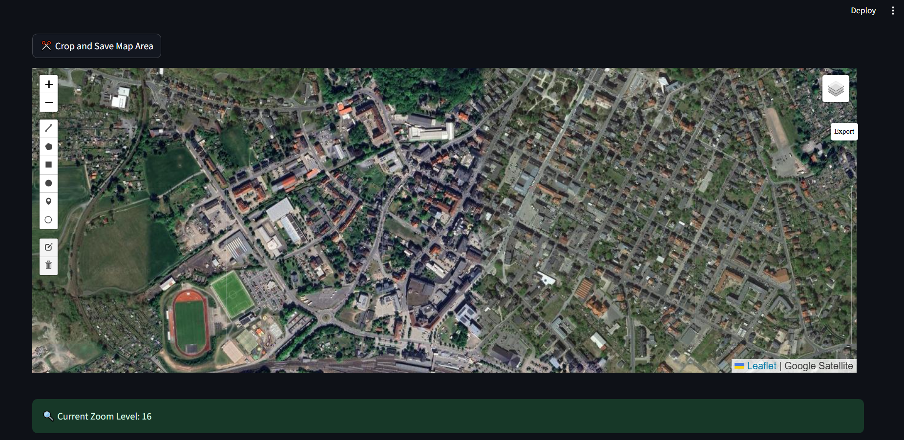
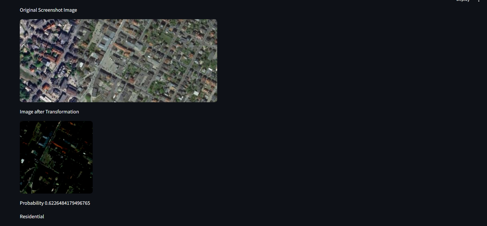

# Satellite Image Recognition

## Objective: Use raw satellite images to predict the picture to be a farmland, residential area, industrial area, river, sea/lake, pasture, forest, highways or herbaceous vegetation

#### ❗ This works only for Europe

#### Dataset used is EuroSAT

The Confusion Matrix of the model

#### Reproducibility:

#### 1. Download the requirements.txt file, the model "best_model.pth" and app.py from the github. Keep them in the same folder.
#### 2. Create a virtual environment and activate it.
#### 3. type --> "pip install requirements.txt" in the terminal.
#### 4. If you face any difficulty in installing pytorch, please visit the official website of pytorch and copy the link as per your cuda version

#### Steps to use the app.py

#### 1. Make sure you scroll down and make the alignment as shown below:

#### 2. Get to the desired area on the map. Make sure you are visualizing only the European Land.
#### 3. The zoom on the area and then change the vision from "OpenStreet" to "google map". Use the option from the top right.

#### 4. Make sure the area of interest is in the center of screen and the zoom level is 16.
#### 5. Click on "Crop and Save Map Area"
#### 6. Finally the model will show it's prediction in terms of probability and area type.

